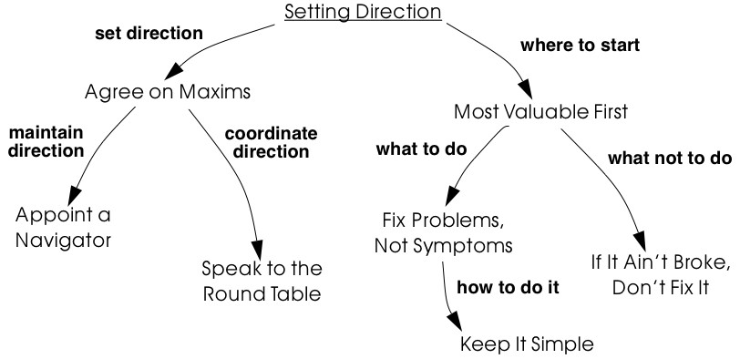

[[setting-direction]]
== 2. Setting Direction

When you start a reengineering project, you will be pulled in many different directions, by management, by the users, by your own team. It is easy to be tempted to focus on the parts that are technically the most interesting, or the parts that seem like they will be easiest to fix. But what is the best strategy? How do you set the direction of the reengineering effort, and how do you maintain direction once you have started?

[[forces]]
=== Forces

* A typical reengineering project will be burdened with a lot of interests that pull in different directions. Technical, ergonomic, economic and political considerations will make it difficult for you and your team to establish and maintain focus.
* Communication in a reengineering project can be complicated by either the presence or absence of the original development team.
* The legacy system will pull you towards a certain architecture that may not be the best for the future of the system.
* You will detect many problems with the legacy software, and it will be hard to set priorities.
* It is easy to get seduced by focussing on the technical problems that interest you the most, rather than what is best for the project.
* It can be difficult to decide whether to wrap, refactor or rewrite a problematic component of a legacy system. Each of these options will address different risks, and will have different consequences for

Figure 2.1: Principles and guidelines to set and maintain direction in reengineering project.

the effort required, the speed with which results can be evaluated, and the kinds of changes that can be accommodated in the future.

* When you are reengineering the system, you may be tempted to over-engineer the new solution to deal with every possible eventuality.

[[overview]]
=== Overview

Setting Direction is a cluster of patterns that can apply to any development project, but also have special relevance to a reengineering effort. As such, we have chosen a _streamlined pattern format_ to describe them (Problem, Solution and Discussion).

You should Agree on Maxims in order to establish a common understanding within the reengineering team of what is at stake and how to achieve it. You should Appoint a Navigator to maintain the architectural vision. Everyone should Speak to the Round Table to maintain team awareness of the state of the project.

To help you focus on the right problems and the critical decisions, it is wise to tackle the Most Valuable First. Note that this will help you to Involve the Users [p. 169] and Build Confidence [p. 172]. In order to decide whether to wrap, refactor or rewrite, you should Fix Problems, Not Symptoms. Change for change’s sake is not productive, so If It Ain’t Broke, Don’t Fix It. Although you may be tempted to make the new system very flexible and generic, it is almost always better to Keep It Simple.

[[agree-on-maxims]]
=== 2.1 Agree on Maxims

*Problem* _How do you establish a common sense of purpose in a team?_

*Solution* _Establish the key priorities for the project and identify guiding principles that will help the team to stay on track._

*Discussion* Any reengineering project must cope with a large number of conflicting interests. Management wants to protect its legacy by improving competitiveness of its product and reducing maintenance costs. Users want improved functionality without disrupting their established work patterns. Developers and maintainers would like their jobs to become simpler without being made obsolete. Your team members may each have their own ideas about what a new system should look like.

Unless there is a clear understand about certain fundamental questions, such as _What is our business model?_ or _Who is responsible for what?_ you risk that the team will be pulled apart by conflicting interests, and you will not achieve your goal. Maxims are rules of conduct that can help steer a project that is pulled in many directions. Goldberg and Rubin [GR95] give numerous examples of maxims, such as _“Everyone is responsible for testing and debugging”_ and _“You cannot do it right the first time.”_
All of the patterns in this chapter can be read as maxims (rather than as patterns), since they are intended to guide a team and keep it on track. A maxim like Most Valuable First, for example, is intended to prevent a team from squandering reengineering effort on technically interesting, but marginal aspects that neither protect nor add value to the legacy system. Agree on Maxims is itself a maxim, that can help a team detect when it is rudderless.

A key point to remember is that any maxim may only have a limited lifetime. It is important to periodically reevaluate the validity of any maxims that have been adopted. A project can get completely off track if you agree on the wrong maxims, or the right ones but at the wrong time.

[[appoint-a-navigator]]
=== 2.2 Appoint a Navigator

*Problem* _How do you maintain architectural vision during the course of complex project?_

*Solution* _Appoint a specific person whose responsibility in role of navigator is to ensure that the architectural vision is maintained._

*Discussion* The architecture of any system tends to degrade with time as it becomes less relevant to new, emerging requirements. The challenge of a reengineering project is to develop a new architectural vision that will allow the legacy system to continue to live and evolve for several more years. Without a navigator, the design and architecture of the old system will tend to creep into and take over the new one.

You should tackle the Most Valuable First so you can determine what are the most critical issues that the new architecture should address, and test those aspects early in the reengineering project.

A sound architecture will help you to Fix Problems, Not Symptoms.
Alan O’Callaghan also refers to the navigator as the “Keeper of the Flame” [ODF99].

[[section]]

[[speak-to-the-round-table]]
=== 2.3 Speak to the Round Table

*Problem* _How do you keep your team synchronized?_

*Solution* _Hold brief, regular round table meetings._

*Discussion* Knowledge and understanding of a legacy system is always distributed and usually hidden. A reengineering team is also performing archeology. The information that is extracted from a legacy system is a valuable asset that must be shared for it to be exploited.

Nobody has time for meetings, but without meetings, communication is ad hoc and random. Regular, focused, round table meetings can achieve the goal of keeping team members synchronized with the current state of affairs. Round table meetings should be brief, but everyone must be required to contribute. A simple approach is to have everyone say _what they have done_ since the last meeting, _what they have learned_ or perhaps _what problems they have encountered_, and _what they plan to do_ until the next meeting.

Round table meetings should be held at least once a week, but perhaps as often as daily.

Minutes of a meeting are important to maintain a log of progress, but keeping minutes can be an unpleasant task. To keep it simple, record only _decisions_ taken and _actions_ to be performed by a certain deadline.

Beck and Fowler recommend “Stand Up Meetings” (meetings without chairs) as a way to keep round table meetings short [BF01].

[[most-valuable-first]]
=== 2.4 Most Valuable First

*Problem* _Which problems should you focus on first?_

*Solution* _Start working on the aspects which are most valuable to your customer._

*Discussion* A legacy system may suffer from a great number of problems, some of which are important, and others which may not be at all critical for the customer’s business. By focusing on the most valuable parts first, you increase the chance that you will identify the right issues at stake, and that you will be able to test early in the project the most important decisions, such as which architecture to migrate to, or what kind of flexibility to build into the new system.

By concentrating first on a part of the system that is valuable to the client, you also maximize the commitment that you, your team members and your customers will have in the project. You furthermore increase your chances of having early positive results that demonstrate that the reengineering effort is worthwhile and necessary.

Nevertheless there are a number of difficulties in applying this pattern: _Who is your customer?_

* There are many stakeholders in any legacy system, but only one of these is your customer. You can only set priorities if you have a clear understanding who should be calling the shots.

_How do you tell what is valuable?_

* It can be difficult to assess exactly what is the most valuable aspect for a customer. Once a company asked us to assess if a system could be modularized because they wanted to switch their architecture. After long discussions with them, however, it turned out that in fact they really wanted to have a system where business rules could be more explicit, a system that new programmers could understand more easily to reduce the risk that only one programmer understands it.
* Try to understand the customer’s business model. This will tell you how to assess the value of the various aspects of the system. Everything that does not relate directly to the business model is likely to be a purely technical side-issue.
* Try to determine what _measurable goal_ the customer wants to obtain. This must be an external manifestation of some aspect of the system or its evolution, for example, better response time, faster time to market of new features, easier tailoring to individual clients needs.
* Try to understand whether the primary goal is mainly to _protect an existing asset_, or rather to _add value_ in terms of new features or capabilities.
* Examine the change logs and determine where the most activity has historically been in the system. The most valuable artifact is often the one which receives the most change requests (see Learn from the Past [p. 127]).
* If the customer is unwilling or unable to set priorities, then play the _Planning Game_ [BF01]: collect requirements from all the stakeholders, and make a ballpark estimate of the effort required for each identifiable task. Given an initial budget of effort for an early first milestone, ask the customer to select tasks that will fit in the budget. Repeat this exercise at each iteration.
* Beware of _changing perceptions_. Initially the customer may draw your attention to certain symptoms of problems with the legacy system, rather than the problems themselves (see Fix Problems, Not Symptoms [p. 28]).

_Isn’t there a risk of raising expectations too high?_

* If you fail to deliver good initial results, you will learn a lot, but you risk losing credibility. It is therefore critical to choose carefully initial tasks which not only demonstrate value for the customer, but also have a high chance of success. Therefore, take great care in estimating the effort of the initial tasks.
* The key to success is to plan for small, frequent iterations. If the initial task identified by the customer is too large to demonstrate initial results in a short time frame (such as two weeks), then insist on breaking it down into smaller subtasks that can be tackled in shorter iterations. If you are successful in your first steps, you will certainly raise expectations, but this is not bad if the steps stay small.

_What if the most valuable part is a rat’s nest?_

* Unfortunately, reengineering a legacy system is often an act of desperation, rather than a normal, periodic process of renovation. It may well be that the most valuable part of the system is also the part that is the most complex, impenetrable and difficult to modify and debug.
* High changes rates may also be a sign of large numbers of software defects. 80% of software defects typically occur in 5% of the code, thus the strategy to “Renovate the Worst First” [Dav95] can pay off big by eliminating the most serious source of problems in the system. There are nevertheless considerable risks:
** it may be hard to demonstrate early, positive results,
** you are tackling the most complicated part of the system with little information,
** the chances are higher that you will fall flat on your face.
* Determine whether to wrap, refactor or rewrite the problematic component by making sure you Fix Problems, Not Symptoms.

Once you have decided what is the most valuable part of the system to work on, you should Involve the Users [p. 169] in the reengineering effort so you can Build Confidence [p. 172]. If you Migrate Systems Incrementally [p. 174], the users will be able to use the system as it is reengineered and provide continuous feedback.

[[fix-problems-not-symptoms]]
=== 2.5 Fix Problems, Not Symptoms

*Problem* _How can you possibly tackle all the reported problems?_

*Solution* _Address the source of a problem, rather than particular requests of your stakeholders._

*Discussion* Although this is a very general principle, it has a particular relevance for reengineering. Each stakeholder has a different viewpoint of the system, and may only see part of it. The problems they want you to fix may just be manifestations of deeper problems in the system. For example, the fact that you do not get immediate feedback for certain user actions may be a consequence of a dataflow architecture. Implementing a workaround may just aggravate the problem and lead to more workarounds. If this is a real problem, you should migrate to a proper architecture.

A common difficulty during a reengineering effort is to decide whether to wrap, refactor or rewrite a legacy component. Most Valuable First will help you determine what priority to give to problems in the system, and will tell you which problems are on your critical path. Fix Problems, Not Symptoms tells you to focus on the source of a problem, and not its manifestation. For example:

* If the code of a legacy component is basically stable, and problems mainly occur with changes to clients, then the problem is likely to be with the interface to the legacy component, rather than its implementation, no matter how nasty the code is. In such a case, you should consider applying Present the Right Interface [p. 187] to just fix the interface.
* If the legacy component is largely defect-free, but is a major bottleneck for changes to the system, then it should probably be refactored to limit the effect of future changes. You might consider applying Split Up God Class [p. 239] to migrate towards a cleaner design.
* If the legacy component suffers from large numbers of defects, consider applying Make a Bridge to the New Town [p. 184] as a strategy for migrating legacy data to the new implementation.

This pattern may seem to conflict with If It Ain’t Broke, Don’t Fix It, but it doesn’t really. Something that is not really “broken” cannot really be the source of a problem. Wrapping, for example, may seem to be a workaround, but it may be the right solution if the real problem is just with the interface to a legacy component.

[[if-it-aint-broke-dont-fix-it]]
=== 2.6 If It Ain’t Broke, Don’t Fix It

*Problem* _Which parts of a legacy system should you reengineer and which should you leave as they are?_

*Solution* _Only fix the parts that are “broken” — those that can no longer be adapted to planned changes._

*Discussion* Change for change’s sake is not necessarily a good thing. There may well be parts of the legacy system that may be ugly, but work well and do not pose any significant maintenance effort. If these components can be isolated and wrapped, it may never be necessary to replace them.

Anytime you “fix” something, you also risk breaking something else in the system. You also risk wasting precious time and effort on marginal issues.

In a reengineering project, the parts that are “broken” are the ones that are putting the legacy at risk:

* components that need to be frequently adapted to meet new requirements, but are difficult to modify due to high complexity and design drift,
* components that are valuable, but traditionally contain a large number of defects.

Software artifacts that are stable and do not threaten the future of the legacy system are not “broken” and do not need to be reengineered, no matter what state the code is in.

[[keep-it-simple]]
=== 2.7 Keep It Simple

*Problem* _How much flexibility should you try to build into the new system?_

*Solution* _Prefer an adequate, but simple solution to a potentially more general, but complex solution._

*Discussion* This is another general principle with special significance for reengineering. We are bad at guessing how much generality and flexibility we really need. Many software systems become bloated as every conceivable feature is added to them.

Flexibility is a double-edged sword. An important reengineering goal is to accommodate future change. But too much flexibility will make the new system so complex that you may actually impede future change.

Some people argue that it is necessary to “plan for reuse”, hence to make an extra effort to make sure that every software entity that might conceivably by useful to somebody else is programmed in the most general way possible, with as many knobs and buttons as possible. This rarely works, since it is pretty well impossible to anticipate who will want to use something for what purpose. The same holds for end-user software.

“Do the simplest thing that will work” is a maxim of Extreme Programming [Bec00] that applies to any reengineering effort. This strategy reinforces Involve the Users [p. 169] and Build Confidence [p. 172] since it encourages you to quickly introduce simple changes that users can evaluate and respond to.

When you do the complex thing, you will probably guess wrong (in terms of what you really need) and it will be harder to fix. If you keep things simple, you will be done faster, get feedback faster, and recover from errors more easily. Then you can make the next step.
