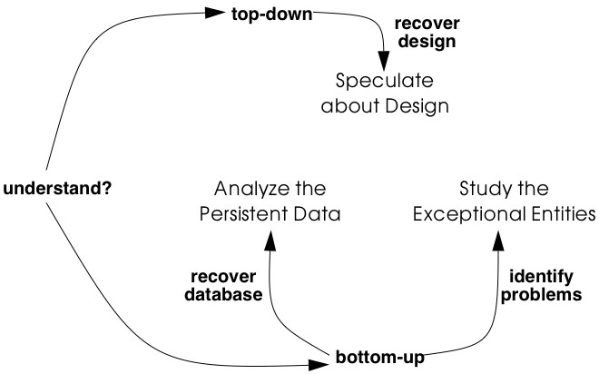
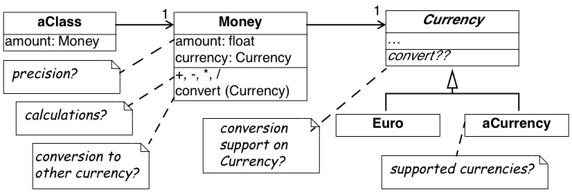
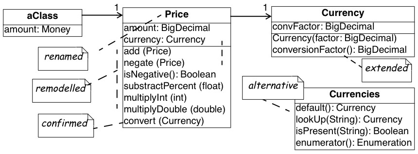
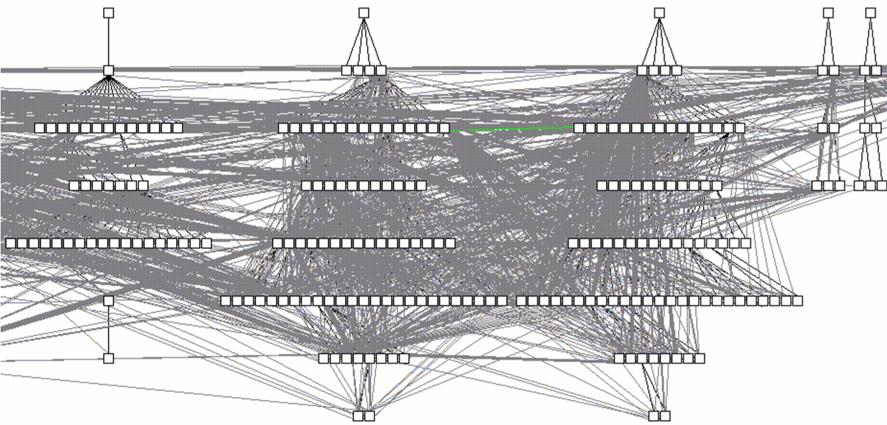
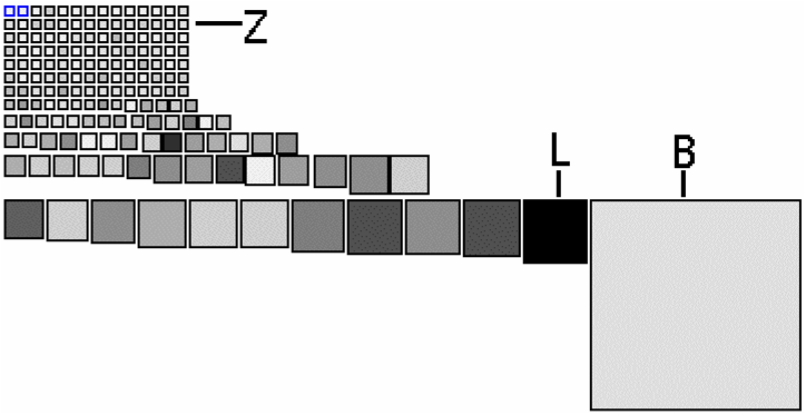
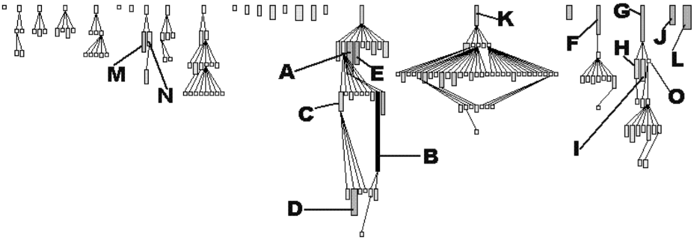
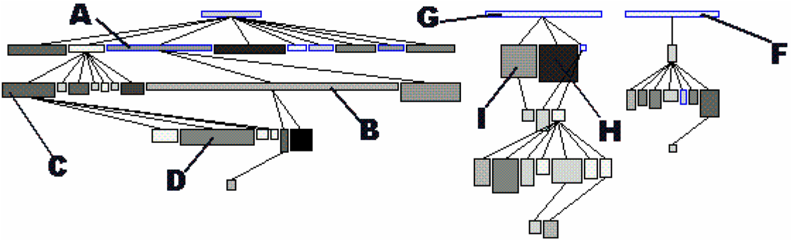
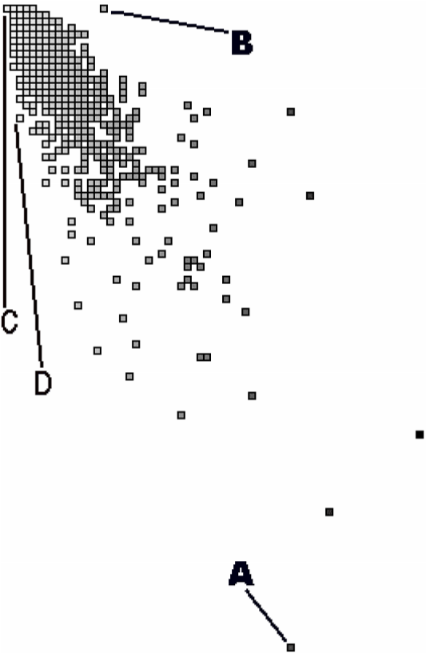

[[initial-understanding]]
== 4. Initial Understanding

Your company develops and distributes a medical information system named _proDoc_ for use by doctors. Now the company has bought a competing software _XDoctor_ product that provides internet support to perform transactions with various health insurance companies. The two products should be merged into a single system.

A first evaluation of _XDoctor_ has revealed that a few components should somehow be recovered and integrated into yours. Of course, to successfully recover a software component, you must understand its inner structure as well as its connections with the rest of the system. For instance, your company has promised that customers “won’t lose a single byte of data”, hence you must recover the database contents and consequently understand the database structure and how the upper layers depend on it. Also, your company has promised to continue and even expand the transaction support with health insurance companies, hence you must recover the network communication component used to communicate with these remote services.

[[forces-2]]
=== Forces

Situations similar to this one occur frequently in reengineering projects. After the First Contact [p. 33] with the system and its users, it is clear what kind of functionality is valuable and why it must be recovered. However, you lack knowledge about the overall design of the software system, so you cannot predict whether this functionality can be lifted out of the legacy system and how much effort that will cost you. Such initial understanding is crucial for the success of a reengineering project and this chapter will explain how to obtain it.

The patterns in First Contact should have helped you to get some first ideas about the software system. Now is the right time to refine those ideas into an initial understanding and to document that understanding in order to support further reverse engineering activities. The main priority at this stage of reverse engineering is to set up a reliable foundation for the rest of your project, thus you must make sure that your discoveries are correct and properly documented.

How to properly document your discoveries depends largely on the scope of your project and the size of the your team. A complicated reverse engineering project involving more than ten developers, demands some standard document templates and a configuration management system. At the other extreme, a run-of-the-mill project involving less than three persons may be able to manage just fine with some loosely structured files shared on a central server. However, there are a few inherent forces that apply to any situation.

* _Data is deceptive._ To understand an existing software system you must collect and interpret data and summarize it in a coherent view. There is usually more than one way to interpret data and when choosing between alternatives you will make assumptions that are not always backed up by concrete evidence. _Consequently, double-check your sources to make sure you build your understanding on a solid foundation._

* _Understanding entails iteration._ Understanding occurs inside the human brain, thus corresponds to a kind of learning process. Reverse engineering techniques must support the way our minds assimilate new ideas, hence be very flexible and allow for a lot of iteration and backtracking. _Consequently, plan for iteration and feedback loops in order to stimulate a learning process._

* _Knowledge must be shared._ Once you understand the system it is important to share this knowledge with your colleagues. Not only will it help them to do their job, it will also result in comments and feedback that may improve your understanding. _Therefore, put the map on the wall:_ publish your discoveries in a highly visible place and make explicit provisions for feedback. How to do this will depend on the team organization and working habits. Team meetings in general are a good way to publish information (see Speak to the Round Table [p. 24]), but a large drawing on the wall near the coffee machine may serve just as well.
* _Teams need to communicate._ Building and documenting your understanding of a system is not a goal; it is a means to achieve a goal. The real goal of understanding the system is to communicate effectively with the other persons involved in the project, thus the way you document your understanding must support that goal. There is for instance no point in drawing UML class diagrams if your colleagues only know how to read ER-diagrams; there is no point in writing use cases if your end users can’t understand their scope. _Consequently, use their language:_ choose the language for documenting your understanding so that your team members can read, understand and comment on what you have documented.

[[overview-2]]
=== Overview

When developing your initial understanding of a software system, incorrect information is your biggest concern. Therefore these patterns rely mainly on source-code because this is the only trustworthy information source.

In principle, there are two approaches for studying source-code: one is top-down, the other is bottom-up. In practice, every reverse engineering approach must incorporate a little bit of both, still it is worthwhile to make the distinction. With the top-down approach, you start from a high-level representation and verify it against the source-code (as for instance described in Speculate about Design). In the bottom-up approach, you start from the source-code, filter out what’s relevant and cast the relevant entities into a higher-level representation. This is the approach used in Analyze the Persistent Data and Study the Exceptional Entities.

There is no preferred order in which to apply each of these patterns. It may be natural to first Analyze the Persistent Data, then refine the resulting model via Speculate about Design and finally exploit this knowledge to Study the Exceptional Entities. Therefore the patterns are presented in that order. However, large parts of your system won’t have anything to do with a database (some systems lack any form of persistent data) and then Speculate about Design must be done without having studied the database. And when you lack the inspiration to start with Speculate about Design, then Study the Exceptional Entities will surely provide you with an initial hypothesis.

The amount of time you should devote to each of these patterns depends largely on the goal of your reengineering project. In principle, none of these patterns will take long, but each of them should be applied several times. You cannot predict how many cycles will be necessary, because the assessment whether your team understands enough to proceed with the rest of the project can only be done after the patterns have been applied.

Therefore, these patterns must be applied on a case-by-case basis.

Figure 4.1: Obtain an Initial Understanding of a software system and cast it into a higher-level representation.

[[what-next-6]]
=== What Next

You should make sure to reflect your increased understanding in the project plan. For instance, Analyze the Persistent Data and Speculate about Design will document parts of the system, and this documentation must be added to the Opportunities. On the other hand, Study the Exceptional Entities will reveal some suspicious components and these must be added to the Risks.

Once you have obtained a solid foundation for your understanding, you should fill in the details for those components that are important for the rest of your project. Activities described in Detailed Model Capture [p. 105] may help you to fill in those details.

[[analyze-the-persistent-data]]
=== 4.1 Analyze the Persistent Data

*Intent* _Learn about objects that are so valuable they must be kept inside a database system._

[[problem-5]]
==== Problem

Which object structures represent the valuable data?

_This problem is difficult because:_

* Valuable data must be kept safe on some external storage device (_i.e._, a file system, a database). However, such data stores often act as an attic: they are rarely cleaned up and may contain lots of junk.
* When loaded in memory, the valuable data is represented by complex object structures. Unfortunately there lies a big gap between the data structures provided by external storage devices and the object structures living in main memory. Inheritance relationships for instance are seldom explicitly provided in a legacy database.
* “Valuable” is a relative property. It is possible that large parts of the saved data are irrelevant for your reengineering project.

_Yet, solving this problem is feasible because:_

* The software system employs some form of a database to make its data persistent. Thus there exists some form of database schema providing a static description of the data inside the database.
* The database comes with the necessary tools to inspect the actual objects inside the database, so you can exploit the presence of legacy data to fine-tune your findings.
* You have some expertise with mapping data-structures from your implementation language onto a database schema, enough to reconstruct a class diagram from the database schema.
* You have a rough understanding of the system’s functionality and the goals of your project (for example obtained via First Contact), so you can assess which parts of the database are valuable for your project.

[[solution-5]]
==== Solution

Analyze the database schema and filter out which structures represent valuable data. Derive a class diagram representing those entities to document that knowledge for the rest of the team.

[[steps]]
===== Steps

The steps below assume that the system makes use of a _relational database_, which is commonly the case for object-oriented applications. However, in case you’re confronted with another kind of database system, many of these steps may still be applicable. The steps themselves are guidelines only: they must be applied iteratively, with liberal doses of intuition and backtracking.

_Preparation._ To derive a class diagram from a relational database schema, first prepare an initial model representing the tables as classes. You may do this by means of a software tool, but a set of index cards may serve just as well.

1.  Enumerate all table names and for each one, create a class with the same name.
2.  For each table, collect all column names and add these as attributes to the corresponding class.
3.  For each table, determine candidate keys. Some of them may be read directly from the database schema, but usually a more detailed analysis is required. Certainly check all (unique) indexes as they often suggest candidate keys. Naming conventions (names including ID or #) may also indicate candidate keys. In case of doubt, collect data samples and verify whether the candidate key is indeed unique within the database population.
4.  Collect all foreign keys relationships between tables and create an association between the corresponding classes. Foreign key relationships may not be maintained explicitly in the database schema and then you must infer these from column types and naming conventions. Careful analysis is required here, as homonyms (= identical column name and type, yet different semantics) and synonyms (= different column name or type, yet identical semantics) may exist. To cope with such difficulties, at least verify the indexes and view declarations as these point to frequent traversal paths. If possible, verify the join clauses in the SQL statements executed against the database. Finally, confirm or refute certain foreign key relationships by inspecting data samples.

_Incorporate inheritance._ After the above steps, you will have a set of classes that represents the tables being stored in the relational database. How-

Figure 4.2: Mapping a series of relational tables onto an inheritance hierarchy. (a) one to one; (b) rolled down; (c) rolled up

ever, because relational databases cannot represent inheritance relationships, you have to infer these from the foreign keys. (The terminology for the three representations of inheritance relations in steps 5-7 stems from [Fro94].)

1.  _One to one_ (Figure 4.2 (a)). Check tables where the primary key also serves as a foreign key to another table, as such foreign keys may represent inheritance relationships. Examine the SELECT statements that are executed against these tables to see whether they usually involve a join over this foreign key. If this is the case, analyze the table names and the corresponding source code to verify whether this foreign key indeed represents an inheritance relationship. If it does, transform the association that corresponds with the foreign key into an inheritance relationship.
2.  _Rolled down_ (Figure 4.2 (b)). Check tables with common sets of column definitions, as these probably indicate a situation where the class hierarchy is spread over several tables, each table representing one non-abstract class. Define a common superclass for each cluster of duplicated column definitions and move the corresponding attributes inside the new class. Check the source code for the name applicable for the newly created classes.
3.  _Rolled up_ (Figure 4.2 (c)). Check tables with many columns and lots of optional attributes as these may indicate a situation where a complete class hierarchy is represented in a single table. If you have found such a table, examine all the SELECT statements that are executed against this table. If these SELECT statements explicitly request for subsets of the columns, then you may break this one class into several classes depending on the subsets requested. For the names of these classes, check for an encoding of subtype information like for instance a “kind” column holding an enumeration type number.

_Incorporate associations._ Note that the class diagram extracted from the database may be too small: it is possible that classes in the actual inheritance hierarchy have been omitted in the database because they did not define any new attributes. Also, table- and column-names may sound bizarre. Therefore, consider to verify the class diagram against the source code (see Speculate about Design) as this may provide extra insight. Afterwards, refine the remaining associations.

1.  Determinate association classes, _i.e._, classes that represent the fact that two objects are associated. The most common example is a many-to-many association, which is represented by a table having a candidate key consisting of two foreign keys. In general, all tables where the candidate keys are concatenations of multiple foreign keys are potential cases of an association class.
2.  Merge complementary associations. Sometimes a class A will have a foreign key association to class B and class B an inverse foreign key to class A. In that case, merge the two associations into a single association navigable in both directions.
3.  Resolve foreign key targets. When inheritance hierarchies have been rolled up or down in the database, foreign key targets may become ambiguous after the table has been decomposed in its constituting classes. Foreign key targets may be too high or too low in the hierarchy, in which case the corresponding association will have too little or too many participating classes. Resolving such situation typically requires analyzing data-samples and SQL statements to see which classes actually participate in the association.
4.  Identify qualified associations, _i.e._, associations that can be navigated by providing a certain look-up key (the qualifier). Common examples are ordered one-to-many associations, where the ordering number serves as the qualifier. In general, all tables where the candidate key combines a foreign key with extra columns are potential qualified associations; the extra columns then represent the qualifier.
5.  Note multiplicities for the associations. Since all associations are derived from foreign key relationships, all associations are by construction optional 1-to-many associations. However, by inspecting nonnull declarations, indices and data samples one can often determine the minimum and maximum multiplicities for each of the roles in the association.
_Verification._ Note the recurring remark that the database schema alone is too weak as a basis to derive a complete class diagram. Fortunately, a legacy system has a populated database and programs manipulating that database. Hence, data samples and embedded SQL statements can be used to verify the reconstructed classes.

* _Data samples._ Database schemas only specify the constraints allowed by the underlying database system and model. However, the problem domain may involve other constraints not expressed in the schema. By inspecting samples of the actual data stored in the database you can infer other constraints.
* _SQL statements._ Tables in a relational database schema are linked via foreign keys. However, it is sometimes the case that some tables are always accessed together, even if there is no explicit foreign key. Therefore, it is a good idea to check which queries are actually executed against the database engine. One way to do this is to extract all embedded SQL statements in the program. Another way is to analyze all executed queries via the tracing facilities provided with the database system.

_Incorporate operations._ It should be clear that the class diagram you extract from a database will only represent the data-structure, not the operations used to manipulate those structures. As such, the resulting class diagram is necessarily incomplete. By comparing the code with the model extracted from the database (see Speculate about Design and Look for the Contracts [p. 123]) it is possible to incorporate the operations for the extracted classes.

[[tradeoffs-5]]
==== Tradeoffs

[[pros-5]]
===== Pros

* _Improves team communication._ By capturing the database schema you will improve the communication within the reengineering team and with other developers associated with the project (in particular the maintenance team). Moreover, many if not all of the people associated with the project will be reassured by the fact that the data schema is present, because lots of development methodologies stress the importance of the database design.
* _Focus on valuable data._ A database provides special features for backup and security and is therefore the ideal place to store the valuable data. Once you understand the database schema it is possible to extract the valuable data and preserve it during future reengineering activities.

[[cons-5]]
===== Cons

* _Has limited scope._ Although the database is crucial in many of today’s software systems, it involves but a fraction of the complete system. As such, you cannot rely on this pattern alone to gain a complete view of the system.
* _Junk data._ A database will contain a lot more than the valuable data and depending on how old the legacy system is a lot of junk data may be stored just because nobody did care to remove it. _Therefore, you must match the database schema you recovered against the needs of your reengineering project._
* _Requires database expertise._ The pattern requires a good deal of knowledge about the underlying database plus structures to map the database schema into the implementation language. As such, the pattern should preferably be applied by people having expertise in mappings from the chosen database to the implementation language.
* _Lacks behavior._ The class diagram you extract from a database is very data-oriented and includes little or no behavior. A truly objectoriented class diagram should encapsulate both data and behavior, so in that sense the database schema shows only half of the picture. However, once the database model exists, it is possible to add the missing behavior later.

[[difficulties-5]]
===== Difficulties

• _Polluted database schema._ The database schema itself is not always the best source of information to reconstruct a class diagram for the valuable objects. Many projects must optimize database access and as such often sacrifice a clean database schema. Also, the database schema itself evolves over time, and as such will slowly deteriorate. _Therefore, it is quite important to refine the class diagram via analysis of data samples and embedded SQL statements.

[[example-5]]
==== Example

While taking over _XDoctor_, your company has promised to continue to support the existing customer base. In particular, you have guaranteed customers that they won’t lose a single byte of data, and now your boss asks you to recover the database structure. From the experience with your own product, you know that doctors care a lot about their patient files and that it is unacceptable to lose such information. Therefore you decide that you will start by analyzing the way patient files are stored inside the database.

You start by browsing all table names looking for a table named Patient, but unfortunately you don’t find one. However, there is a close match in a table named Person, where column names like insuranceID suggest that at least some patient information is stored. Nevertheless, many column names are optional, so you suspect a rolled up representation where

//FIXME: image missing 

Figure 4.3: Identify a qualified association via a key consisting of a foreign key (patientID) and two extra columns (date, nr). patient information is mixed with information from other kinds of persons. Therefore, you check the source-code and look for all embedded SQL statements querying the table Person (_i.e._,grep "SELECT * Person"). Indeed, there are two classes where such a query is used, namely Patient and Salesman and from the subsets of columns queried in each class, you infer the inheritance hierarchy depicted in Figure 4.2.

Now that you recovered the Patient, you start looking for the table that stores the treatments a patient received. And indeed there is a table Treatment which has a foreign key to the table Person. However, since you have decomposed Person into the classes Patient and Salesman, it is necessary to resolve the target of the foreign key. You join the tables Person and Treatment over patientID (SELECT DISTINCT name, kind FROM Person, Treatment WHERE Person.id = Treatment.patientID) and see that all selected persons indeed have a kind which corresponds to a Patient. Therefore, you set the target of the foreign key leaving from Treatment to

Patient (see left side of Figure 4.2). Next, you verify the indices defined on Treatment and notice that there is a unique index on the columns patientID - date - nr, which makes you conclude that these columns serve as a candidate key. Since the candidate key on Treatment consists of a foreign key combined with two extra columns, you suspect a qualified association. To confirm this assumption you analyze a data sample (SELECT name, date, nr FROM Person, Treatment WHERE Person.id = Treatment.patientID ORDER BY name, date, nr) and see that the date and the number uniquely identify a treatment for a given patient. As a consequence, you transform the foreign key into a qualified association had-treatment with a multiplicity of one on each role.

[[rationale-4]]
==== Rationale

_The object model is important for database applications because it concisely describes data structure and captures structural constraints.
— Michael Blaha, et al. [BLM98]_

Having a well-defined central database schema is a common practice in larger software projects that deal with persistent data. Not only does it specify common rules on how to access certain data structures, it is also a great aid in dividing the work between team members. Therefore, it is a good idea to extract an accurate model of the database before proceeding with other reverse engineering activities.

Note that extracting a database model is essentially a bottom-up approach: you start from the rough information contained in the database schema and you polish it up until you have a satisfactory class diagram. A bottom up approach works quite well in such a situation, because a database schema is already an abstraction from a more detailed representation.

_All data should be hidden within its class.
— Arthur Riel, Heuristic 2.1 [Rie96]_

Information hiding is an important design principle, and most authors agree that for a class this implies that all data should be encapsulated within the class and only accessed via the operations defined on that class. Unfortunately, the class diagram you extract from a database will expose all of its data, because that’s the nature of a database. Therefore, this class diagram is just a first step towards a well-designed interface to the database.

[[known-uses-5]]
==== Known Uses

The reverse engineering and reengineering of database systems is a well explored area of research [Arn92] [MJS+00]. Several experiments indicate that it is feasible to recover the database structure, even for these database systems that are poorly designed. [PB94] for instance reports about an experiment concerning the reverse engineering of a data dictionary of a leading RDBMS vendor, as well as a production database storing data about mechanical parts. [HEH+96] describes a prototype database reverse engineering toolkit, as well as five industrial cases where the toolkit has been applied. To illustrate the unpredictable nature of database reverse engineering, [JSZ97] reports on the use of a fuzzy reasoning engine as the core of a tool that extracts class diagrams out of relational database schemas.

[[what-next-7]]
==== What Next

Analyze the Persistent Data results in a class diagram for the persistent data in your software system. Such a class diagram is quite rough and is mainly concerned with the structure of the data and not with its behavior. However, it may serve as an ideal initial hypothesis to be further refined by applying Speculate about Design and Look for the Contracts [p. 123].

If you need to migrate to another database, you should cast your understanding of the database model in a test suite as explained in Tests: Your Life Insurance! [p. 135].

Note that there exist patterns, idioms and pattern languages that describe various ways to map object-oriented data structures on relational database counterparts [BW96] [KC98b]. Consulting these may help you when you are reverse engineering a database schema.

[[speculate-about-design]]
=== 4.2 Speculate about Design

*Intent* _Progressively refine a design against source code by checking hypotheses about the design against the source code._

[[problem-6]]
==== Problem

How do you recover the way design concepts are represented in the source-code?

_This problem is difficult because:_

* There are many design concepts and there are countless ways to represent them in the programming language used.
* Much of the source-code won’t have anything to do with the design but rather with implementation issues (glue code, user-interface control, database connections,-).

_Yet, solving this problem is feasible because:_

* You have a _rough understanding_ of the system’s functionality (for example obtained via Skim the Documentation [p. 52] and Interview During Demo [p. 59]), and you therefore have an initial idea which design issues should be addressed.
* You have _development expertise_, so you can imagine how you would design the problem yourself.
* You are _somewhat familiar_ with the main structure of the source code (for example obtained by Read all the Code in One Hour [p. 45]) so that you can find your way around.

[[solution-6]]
==== Solution

Use your development expertise to conceive a hypothetical class diagram representing the design. Refine that model by verifying whether the names in the class diagram occur in the source code and by adapting the model accordingly. Repeat the process until your class diagram stabilizes.

[[steps-1]]
===== Steps

1.  With your understanding of the system, develop a class diagram that serves as your initial hypothesis of what to expect in the source code. For the names of the classes, operations and attributes make a guess based on your experience and potential naming conventions (see Skim the Documentation [p. 52]).
2.  Enumerate the names in the class diagram (that is, names of classes, attributes and operations) and try to find them in the source code, using whatever tools you have available. Take care as names inside the source-code do not always match with the concepts they represent.footnote:[In one particular reverse engineering experience, we were facing source code that was a mixture of English and German. As you may expect, this complicates matters a lot.] To counter this effect, you may rank the names according to the likelihood that they appear in the source code.
3.  Keep track of the names that appear in source code (confirm your hypothesis) and the names which do not match with identifiers in the source code (contradict your hypothesis). Remember that mismatches are positive, as these will trigger the learning process that you must go through when understanding the system.
4.  Adapt the class diagram based on the mismatches. Such adaptation may involve
a.  _renaming_, when you discover that the names chosen in the source code do not match with your hypothesis;
b.  _remodelling_, when you find out that the source-code representation of the design concept does not correspond with what you have in your model. For instance, you may transform an operation into a class, or an attribute into an operation.
c.  _extending_, when you detect important elements in the source-code that do not appear in your class diagram;
d.  _seeking alternatives_, when you do not find the design concept in the source- code. This may entail trying synonyms when there are few mismatches but may also entail defining a completely different class diagram when there are lots of mismatches.
5.  Repeat steps 2-4 until you obtain a class diagram that is satisfactory.

[[variants-1]]
===== Variants

_Speculate about Business Objects._ A crucial part of the system design is the way concepts of the problem domain are represented as classes in the source code. You can use a variant of this pattern to extract those so-called “business objects”.

One way to build an initial hypothesis is to use the noun phrases in the requirements as the initial class names and the verb phrases as the initial method names (See [WBWW90] [BS97] [Boo94] for in-depth treatments of finding classes and their responsibilities).You should probably augment this information via the usage scenarios that you get out of Interview During Demo [p. 59] which may help you to find out which objects fulfil which roles. (See [JCJO92] [SW98] for scenarios and use cases and [Ree96] [RG98] for role modeling.)

_Speculate about Patterns._ Patterns are “recurring solutions to a common design problem in a given context”. Once you know where a certain pattern has been applied, it reveals a lot about the underlying system design. This variant verifies a hypothesis about occurrences of architectural [BMR^+^96], analysis [Fow97] or design patterns [GHJV95].

_Speculate about Architecture._ “A software architecture is a description of the subsystem and components of a software system and the relationships between them” [BMR^+^96] (a.k.a. Components and Connectors [SG96]). The software architecture is typically associated with the coarse level design of a system and as such it is crucial in understanding the overall structure. Software architecture is especially relevant in the context of a distributed system with multiple cooperating processes, an area where reverse engineering is quite difficult.

This variant builds and refines a hypothesis about which components and connectors exist, or in the context of a distributed system, which processes exist, how they are launched, how they get terminated and how they interact. Consult [BMR+96] for a catalogue of architectural patterns and [SG96] for a list of well-known architectural styles. See [Lea96] for some typical patterns and idioms that may be applied in concurrent programming and [SSRB00] for architectural patterns in distributed systems.

[[tradeoffs-6]]
==== Tradeoffs

[[pros-6]]
===== Pros

* _Scales well._ Speculating about what you’ll find in the source code is a technique that scales up well. This is especially important because for large object-oriented programs (over a 100 classes) a bottom-up approach quickly becomes impractical.
* _Investment pays off._ The technique is quite cheap in terms of resources and tools, definitely when considering the amount of understanding one obtains.

[[cons-6]]
===== Cons

* _Requires expertise._ A large repertoire of knowledge about idioms, patterns, algorithms, techniques is necessary to recognize what you see in the source code. As such, the pattern should preferably be applied by experts.
* _Consumes much time._ Although the technique is quite cheap in terms of resources and tools, it requires a substantial amount of time before one derives a satisfactory representation.

[[difficulties-6]]
===== Difficulties

• _Maintain consistency._ You should plan to keep the class diagram up to date while your reverse engineering project progresses and your understanding of the software system grows. Otherwise your efforts will be wasted. Therefore, make sure that your class diagram relies heavily on the naming conventions used in the source-code and that the class diagram is under the control of the configuration management system.

[[example-6]]
==== Example

While taking over _XDoctor_, your company has promised to continue to support the existing customer base. And since Switzerland will be joining the Euro-region within six months, the marketing department wants to make sure that Euro conversions will be supported properly. A first evaluation has revealed that the Euro is supported to some degree (_i.e._, it was described in the user manual and there exists a class named Currency). Now, your boss asks you to investigate whether they can meet the legal obligations, and if not, how long it will take to adapt the software.

From a previous code review, you learned that the design is reasonably good, so you suspect that the designers have applied some variant of the Quantity [p. 294] pattern. Therefore, you define an initial hypothesis in the form of the class diagram depicted in Figure 4.4 (a). There is one class Money holding two attributes; one for the amount of money (a floating point number) and one for the currency being used (an instance of the Currency class). You assume operations on the Money class to perform the standard calculations like addition, substraction, multiplication, ··· plus one operation for converting to another currency. Currency should have subclasses for every currency supported and then operations to support the conversion from one currency into another. Of course, some questions are left unanswered and you note them down on your class diagram.

a.  Initial hypothesis where the open questions are inserted as Notes

a.  Refined hypothesis after verification against the source code; the modificationsare shown as Notes

Figure 4.4: Refining the hypotheses concerning the Euro representation. (a) subclasses for the different currencies; (b) flyweight approach for the currencies

1.  What is the precision for an amount of Money?
2.  Which calculations are allowed on an instance of Money?
3.  How do you convert an instance of Money into another currency?
4.  How is this conversion done internally? How is the support from the Currency class?
5.  Which are the currencies supported?

To answer these questions you verify your hypothesis against the source code and you adapt your class diagram accordingly. A quick glance at the filenames reveals a class Currency but no class named Money; a grep-search on all of the source code confirms that no class Money exists. Browsing which packages import Currency, you quickly find out that the actual name in the source code is Price and you rename the Money class accordingly.

Looking inside the Price class reveals that the amount of money is represented as a fixed point number. There is a little comment-line stating:

Michael (Oct 1999) ---- Bug Report #324 ---- Replaced Float by BigDecimal due to rounding errors in the floating point representation. Trimmed down the permitted calculation operations as well.

Checking the interface of the Price class you see that the calculation operations are indeed quite minimal. Only addition and negation (apparently substraction must be done via an addition with a negated operand) and some extra operations to take percentages and multiply with other numbers. However, you also spot a convert operation which confirms your hypothesis concerning the conversion of prices.

Next you look for subclasses of Currency, but you don’t seem to find any. Puzzled, you start thinking about alternative solutions and after a while you consider the possibility of a Flyweight [p. 294]. After all, having a separate subclass for each currency is a bit of an overhead because no extra behavior is involved. Moreover, with the flyweight approach you can save a lot of memory by representing all occurrences of the Euro-currency with a single Euro-object. To verify this alternative, you look for all occurrences of constructor methods for Currency — a grep Currency does the trick — and you actually discover a class Currencies which encapsulates a global table containing all currencies accepted. Looking at the initialize method, you learn that the actual table contains entries for two currencies:

Euro and Belgian Francs.

Finally, you study the actual conversion in a bit more detail by looking at the Price.convert operation and the contents of the Currency class. After some browsing, you discover that each Currency has a single conversion factor. This makes you wonder: isn’t conversion supposed to work in two ways and between all possible currencies? But then you check all invocations of the conversionFactor method and you deduce that the conversion is designed around the notion of a default currency (_i.e._, the Currencies.default() operation) and that the conversionFactor is the one that converts the given currency to the default one. Checking the Price.convert operation, you see that there is indeed a test for default currency in which case the conversion corresponds to a simple multiplication. In the other case, the conversion is done via a two step calculation involving an intermediate conversion to the default currency.

You’re quite happy with your findings and you adapt your class diagram to the one depicted in figure 10(b). That model is annotated with the modifications you made to the original hypothesis, thus you store both the original and refined model into the configuration management system so that your colleagues can reconstruct your deduction process. You also file the following report summarizing your findings.

_Conversion to Euro._ Facilities for Euro conversion are available, but extra work is required. One central class (Currencies) maintains a list of supported currencies including one default currency (Currencies.default). To convert to Euro, the initialization of this class must be changed so that the default becomes Euro. All prices stored in the database must also be converted, but this is outside the scope of my study.

Follow-up actions:

* Adapt initialization of class Currencies so that it reads the default currency and conversion factors from the configuration file.
* Check the database to see how Prices should be converted.

[[rationale-5]]
==== Rationale

The naive approach to design extraction is bottom-up: first build a complete class diagram from source code and afterwards condense it by removing the noise. Unfortunately, the bottom-up approach does not work for large scale systems, because one typically gets a lot of white noise to start from (see for example Figure 4.5, showing an inheritance hierarchy with associations for a medium-sized system). Moreover, such a bottomup approach does not improve your understanding very much, because it forces you to focus on the irrelevant noise instead of the important concepts.

Figure 4.5: White-noise obtained by a bottom-up design extraction approach. 

The figure shows a fragment of an inheritance hierarchy augmented with all method invocations and attribute accesses for a medium sized system. The visualization is performed by CodeCrawler [DDL99] [Lan99].

_“We get things wrong before we get things right.”
— Alistair Cockburn, [Coc93]_

In order to gain a true understanding of the legacy problem, you must go through a learning process. Speculate about Design is intended to stimulate such a learning process and therefore evidence that contradicts your hypothesis is as valuable as evidence that confirms it. Indeed, mismatches force you to consider alternative solutions and assess their pros and cons, and that is the moment when true understanding emerges.

[[known-uses-6]]
==== Known Uses

In [MN97], there is a report of an experiment where a software engineer at Microsoft applied this pattern (it is called “the Reflection Model” in the paper) to reverse engineer the C-code of Microsoft Excel. One of the nice sides of the story is that the software engineer was a newcomer to that part of the system and that his colleagues could not spend too much time to explain it to him. Yet, after a brief discussion he could come up with an initial hypothesis and then use the source code to gradually refine his understanding. Note that the paper also includes a description of a lightweight tool to help specifying the model, the mapping from the model to the source code and the checking of the code against the model.

The articles [Big89] [BMW93] [BMW94], report several successful uses of this pattern (there it is called the “concept assignment problem”). In particular, the authors describe a tool-prototype named DESIRE, which includes advanced browsing facilities, program slicing and a Prolog-based query language. The tool has been used by a number of people in different companies to analyze programs of up to 220 KLOC. Other well- known applications are reported by the Rigi group, which among others have applied this pattern on a system consisting of over 2 million lines of PL/AS code [WTMS95].

It has been shown that such an approach can be used to map an object-oriented design onto a procedural implementation purely based on a static analysis of the source-code [GW99] [WG98]. Nevertheless, newer approaches try to exploit richer and more diverse information sources. DALI for instance also analyses information from makefiles and profilers [BCK98] [KC98a] [KC99]. Gaudi on the other hand, verifies the hypothesis against a mixture of the static call graphs with run-time traces [RD99].

[[what-next-8]]
==== What Next

After this pattern, you will have a class diagram representing a part of the design. You may want to Study the Exceptional Entities to get an impression of the design quality. If you need a more refined model, consider the patterns in Detailed Model Capture [p. 105]. When your reverse engineering efforts are part of a migration or reengineer project, you should cast your understanding of design in a test suite as explained in Tests: Your Life Insurance! [p. 135]

[[study-the-exceptional-entities]]
=== 4.3 Study the Exceptional Entities

*Intent* _Identify potential design problems by collecting measurements and studying the exceptional values._
[[problem-7]]
==== Problem

How can you quickly identify potential design problems in large software systems?

_This problem is difficult because:_

* There is no easy way to discern problematic from good designs. Assessing the quality of a design must be done in the terms of the problem it tries to solve, thus can never be inferred from the design alone.
* To confirm that a piece of code represents a design problem, you must first unravel its inner structure. With problematic code this is typically quite difficult.
* The system is large, thus a detailed assessment of the design quality of every piece of code is not feasible.

_Yet, solving this problem is feasible because:_

* You have a _metrics tool_ at your disposal, so you can quickly collect a number of measurements about the entities in the source-code.
* You have a _rough understanding_ of the system’s functionality (for example obtained via First Contact), so you can assess the quality of the design in the system context.
* You have the necessary _tools to browse_ the source-code, so you can verify manually whether certain entities are indeed a problem.

[[solution-7]]
==== Solution

Measure the structural entities forming the software system (_i.e._, the inheritance hierarchy, the packages, the classes and the methods) and look for exceptions in the quantitative data you collected. Verify manually whether these anomalies represent design problems.

[[hints-5]]
===== Hints

Identifying problematic designs in a software system via measurements is a delicate activity which requires expertise in both data collection and interpretation. Below are some hints you might consider to get the best out of the raw numbers.

* _Which tool to use?_ There are many tools — commercial as well as public domain — which measure various attributes of source code entities. Nevertheless, few development teams make regular use of such tools and therefore it is likely that you will have to look for a metrics tool before applying this pattern.

In principle, start by looking at the tools used by the development team and see whether they can be used to collect data about the code. For instance, a code verification tool such as lint can serve as basis for your measurements. Start looking for a metrics tool only when none of the development tools currently in use may collect data for you. If that’s the case, simplicity should be your main tool adoption criterion as you do not want to spend your precious time on installing and learning. The second tool adoption criterion is how easy the metrics tool integrates with the other development tools in use.

* _Which metrics to collect?_ In general, it is better to stick to the simple metrics, as the more complex ones involve more computation, yet will rarely perform better.

For instance, to identify large methods it is sufficient to count the lines of code by counting all carriage returns or new-lines. Most other method size metrics require some form of parsing and this effort is usually not worth the gain.

* _Which metric variants to use?_ Usually, it does not make a lot of difference which metric variant is chosen, as long as the choice is clearly stated and applied consistently. Here as well, it is preferable to choose the most simple variant, unless you have a good reason to do otherwise.

For instance, while counting the lines of code, you should decide whether to include or exclude comment lines, or whether you count the lines after the source code has been normalized via pretty printing. However, when looking for potential design problems it usually does not pay off to do the extra effort of excluding comment lines or normalizing the source code.

* _Which thresholds to apply?_ Due to the need for reliability, it is better _not_
to apply thresholds.footnote:[Most metric tools allow you to focus on special entities by specifying some threshold interval and then only displaying those entities where the measurements fall into that interval.] First of all, because selecting threshold values must be done based on the coding standards applied in the development team and these you do not necessarily have access to. Second, thresholds will distort your perspective on the anomalies inside the system as you will not know how many normal entities there are.
* _How to interpret the results?_ An anomaly is not necessarily problematic, so care must be taken when interpreting the measurement data. To assess whether an entity is indeed problematic, it is a good idea to simultaneously inspect different measurements for the same entity. For instance, do not limit yourself to the study of large classes, but combine the size of the class with the number of subclasses and the number of superclasses, because this says something about where the class is located in the class hierarchy.

However, formulas that combine different measurements in a single number should be avoided as you loose the sense for the constituting elements. Therefore it is better to present the results in a table, where the first column shows the name of the entity, and the remaining columns show the different measurement data. Sorting these tables according to the different measurement columns will help you to identify exceptional values.

* _How to identify anomalies quickly?_ Although it is possible to identify exceptional values in a tabular representations of measurement data, such an approach is tedious and error-prone. Most metric tools include some visualization features (histograms, scatter plots, ···) to help you scan large volumes of measurements and this is usually a better way to quickly focus on potential design problems.
* _Should I browse the code afterwards?_ Measurements alone cannot determine whether a entity is truly problematic: some human assessment is always necessary. Metrics are a great aid in quickly identifying entities that are potential problems but code browsing is necessary for confirmation. Note that large entities are usually quite complicated, thus understanding the corresponding source code may prove to be difficult.
* _What about normal entities?_ Experienced programmers tend to distribute important functionality over a number of well- designed components. Conversely, exceptional entities are quite often irrelevant as truly important code would have been refactored. Therefore, you should be aware that you are only applying a heuristic: its possible that you are studying code which does not represent a design problem simply because it is deemed unimportant.

[[tradeoffs-7]]
==== Tradeoffs

[[pros-7]]
===== Pros

* _Scales well._ Metrics are readily applicable to large scale systems, mainly because with metric tools about 20% of all the entities require further investigation. When different metrics are combined properly (preferably using some form of visualization) one can deduce quite rapidly which parts of the system represent potential design problems.
* _Overview mode is appealing._ With proper tool support you can produce visual representations of the metrics data that provide immediate insight into the good as well as the problematic parts of the design.

[[cons-7]]
===== Cons

* _Results are inaccurate._ Some of the entities having exceptional measurements will turn out not to be problematic. Metrics are only a heuristic and false positives are likely to occur. Moreover, the metric may reveal problems that are not worth solving because the solutions will not contribute to your reengineering goal. Unfortunately, this you will only know after you analyzed the source code.
* _Missing priorities._ Identifying a potential problem is easy, the real difficult part is assessing the severity of the problem. Especially during a reengineering project, you identify far more problems than you have time to solve. Prioritizing the list requires a good understanding of both the system and the reengineering project.

[[difficulties-7]]
===== Difficulties

* _Data is tedious to interpret._ To measure the quality of a piece of code, you must collect several measurements. Interpreting and comparing such multi-valued tuples is quite tedious especially when dealing with large software systems. Therefore, use visualizations which allow you to analyze different measurements simultaneously.
* _Requires expertise._ The interpretation of measurement data is difficult and requires a lot of expertise. Fortunately, part of this expertise is documented in the form of design heuristics (see among others [Rie96] [LK94]) and the rest can be acquired on the job.

Figure 4.6: Class size overview with node size showing the lines of code and gray value showing the number of instance variables.

[[example-7]]
==== Example

The analysis of the database and the design of _XDoctor_ was quite reassuring. Although there were some things to improve, the overall quality was quite good. Yet, you want to confirm this feeling and therefore plan to collect a number of quality metrics and visualize them. (Of course the visualization can be done with ordinary spreadsheets, but in this case you decide to use the CodeCrawler tool [DDL99] [Lan99].)

_Class Size Overview._ As a starter, you get an impression of the raw physical size of all the classes constituting _XDoctor_. You measure the class size in terms of number of lines of code (LOC) and number of instance variables (NIV) and use a _checkers graph_ to show the relative proportion of the sizes. In such a graph all nodes are shown as squares where the size of the square is proportional to one size (here LOC) and the gray value is proportional to another size (here NIV).

Figure 4.6 shows the checker graph for _XDoctor_. The picture reveals that the class size is distributed quite evenly — which is reassuring — with a few noteworthy exceptions. For instance, there is the class B (with 1495 it is the largest in terms of lines of code) and class L (has most instance variables and second most lines of code). The classes in row Z are exceptional in the sense that they are very small, some of them even empty.

_Class Inheritance._ Next, you get a feeling for the way inheritance is used by studying the various subtrees in the inheritance hierarchy. Therefore, you measure the classes in terms of hierarchy nesting level (HNL) and number of descendant classes (NDC). You include size measurements as well to assess the magnitude of the classes within the inheritance tree. Therefore, you collect the number of methods (NOM), number of instance variables (NIV) and number of lines of code (LOC) as well. 

Figure 4.7: Inheritance tree focussing on class size. The node width shows the number of instance variables, the node height shows the number of methods and the gray value shows the number of code lines.

You use an _inheritance tree_ to visualize the various subtrees and the proportion of class sizes inside each of them. All nodes in such a tree have a rectangular shape where the height, width and gray value of each node show three measurements.

Figure 4.7 shows such an inheritance tree for _XDoctor_, where the height, width and gray value of each node represent NOM, NIV and LOC. To the left, you observe several normal inheritance trees, namely small ones where the size of the classes is quite similar. One exceptional value is the same B you noticed earlier, however you now see that it also has a large superclass A (defining 70 methods), making it even more suspicious. The L you’ve seen before appears here as a solitary class. The hierarchies rooted in K, F and G seem quite interesting: they go deep (4 levels of inheritance) and have one large root class plus many smaller subclasses. H and I, plus M and N are both cases of large sibling classes, which may imply that too little is inherited from the common superclass. This must be verified via code browsing however.

_Method Inheritance._ To analyze particular inheritance trees in further detail, you investigate how methods in a subclass relate to methods in their superclass. Therefore, you produce a table showing for each class the number of methods overriding a method defined in a superclass (NMO), the number of methods added to the superclass (NMA) and the number of methods extending a method defined in a superclass (NME). Here as well you use an inheritance tree to identify exceptional values in the measurements.

Figure 4.8 shows the A, G and F subtrees identified earlier, but now the height, width and gray value of each node represent NMO, NMA and NME. The root classes are displayed as narrow white rectangles, which is normal as root classes cannot override nor extend.

Figure 4.8: Inheritance tree focussing on method inheritance. The node width shows the number of methods added, the node height shows the number of methods overridden and the gray value shows the number of methods extended.

 As far as the subclasses concerns, you observe two phenomena. On the one hand, the subclasses of A add a lot, yet override very little, which suggests that code reuse is the main purpose of this inheritance tree. On the other hand, the subclasses of F and G override more methods than they add, which suggests a lot of hook methods and an inheritance tree aimed at specializing behavior. Here as well, these assumptions must be verified by code browsing.

_Method Size Overview._ An example of how to identify potential problems in the method bodies concerns the ratio of lines of code (LOC) and the number of messages sent (MSG). In most method bodies, these two measurements will correlate but methods where this correlation does not hold typically represent special code.

To study this correlation relationship one might divide the two measurements. footnote:[Metrics theory prohibits arbitrary manipulations of numbers; one should first verify whether the scale of the measurement permits the calculation [FP96]. However, both are counting measurements having a ratio scale and then division is permitted.] However, then you lose the sense for the constituting measurements which makes interpretation difficult. Therefore, you visualize the relationship by means of a _correlation graph_, where each method is shown as a small square and where the x, y position shows the measurements that are supposed to correlate. In such a graph, the nodes where the measurements correlate cluster around a diagonal, while the exceptions are from the diagonal.

Figure 4.9 shows a correlation graph where the horizontal axis (left to right) represents the number of messages sent and the vertical axis (top to bottom) the number of lines of code. You observe a big cluster in the top left corner where most nodes are superimposed on each other. 

Figure 4.9: Correlation graph, with x-position showing the number of messages sent and y-position showing the lines of code.

This is reassuring because it implies that most methods have fewer than 15 lines of code and 10 messages sent. The exceptions appear at the edges of the picture. For instance, node A is a large method with 99 messages packed on 45 lines of code. Node D (and its neighbors) are also methods where many messages are packed on a single line of code. Via code browsing you see that many of them are initialization methods. At the other side of the diagonal there is node B, which represents a method with 16 lines of code yet no messages sent. Code browsing reveals that it’s a case where the whole method body has been commented out.

[[rationale-6]]
==== Rationale

_You cannot control what you cannot measure.
— Tom De Marco, [Mar82]_

In several places in the literature it is mentioned that measuring source code helps in problem identification (see among others, [LK94] [FP96] [MLM96] [Nes88]). Most metric tools applied during these experiments visualize information by means of histograms and Kiviat diagrams. However, few research have studied the impact of thresholds while identifying exceptional entities; our own experience is that thresholds don’t really matter [DD99].

Unfortunately, the current research is inconclusive with regards to the accuracy of the results. Up until now, no experiments exist that count how many problems remain undiscovered, nor is there any work on assessing the severity of the problems discovered. As such it is impossible to assess the reliability of metrics for reverse engineering.

[[known-uses-7]]
==== Known Uses

During the FAMOOS project one event provided anecdotal evidence for how well a simple approach may outperform more specialized and complex approaches. Once we visited a business unit for a few days to demonstrate our CodeCrawler tool. At first the developers were quite sceptical because they felt like they would see “yet another metrics tool”. The first surprise came when we showed them results already during the first day. They told us that other tools would typically require several days configuration time before they could parse their C++ code because it made such heavy use of special C++ features and macros. Moreover, and this was the second surprise, this simplicity did not diminish the quality of our results. The programmers confirmed most of the design anomalies we discovered, yet were intrigued by some observations we made. During the subsequent discussions they at least considered design alternatives.

[[what-next-9]]
==== What Next

Applying this pattern will result in an overall impression of design quality and the identification of a few potential design problems. With this knowledge you should at least reconsider whether the goal of your reengineering project is still attainable. If it is, you will probably want to solve some of these design problems, for instance using patterns in Redistribute Responsibilities [p. 217] and Transform Conditionals to Polymorphism [p. 245]. Solving some of these problems may require a more detailed understanding of that design, which may be obtained by patterns in Detailed Model Capture [p. 105].
